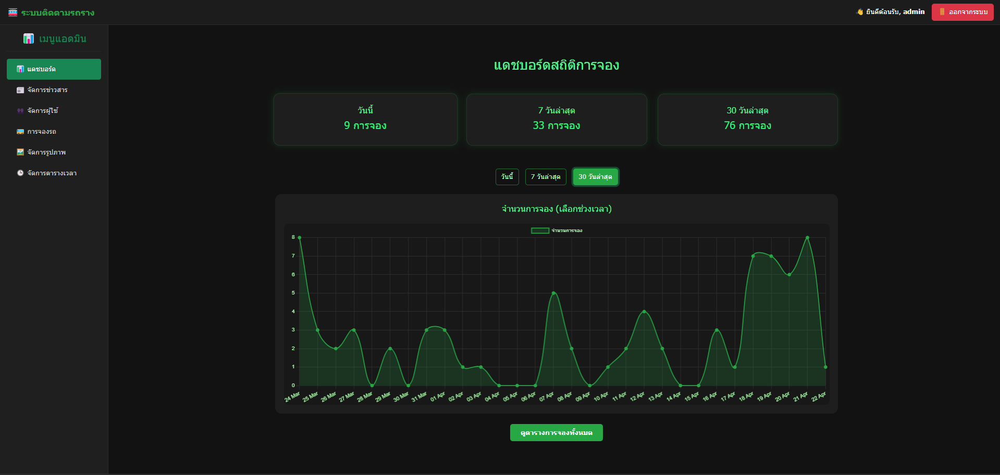

# 🚌 Bus Tracking System (Web-Based Application)

## 📌 Overview
This project is a web-based bus tracking system developed to improve transportation management and user convenience through real-time GPS tracking technology.

The system allows users to monitor bus locations in real time, view estimated arrival times (ETA), reserve seats, and access transportation information through an interactive web application.

An admin dashboard is also provided to manage bus operations and monitor system activity efficiently.

---

## 🎯 Objective
- Develop a real-time bus tracking web application  
- Display live bus locations using GPS technology  
- Improve transportation accessibility and user convenience  
- Provide ETA (Estimated Time of Arrival) predictions  
- Support transportation management through an admin dashboard  

---

## 🛠️ Tech Stack
- **Database:** PostgreSQL  
- **Backend:** PHP (RESTful APIs)  
- **Frontend:** HTML, CSS, JavaScript  
- **Map & GPS:** Google Maps API, GPS Data  
- **Data Visualization:** Power BI  
- **Other Tools:** Bootstrap, Leaflet.js  

---

## 📌 Key Features
- 📍 Real-time GPS bus tracking  
- 🗺️ Interactive route and location map  
- ⏱️ ETA (Estimated Time of Arrival) prediction  
- 💺 Seat reservation system  
- 🔐 User authentication and session management  
- 📊 Admin dashboard for monitoring bus operations  
- 📢 Announcement and news management system  
- 📱 Responsive web design for desktop and mobile devices  

---

## 📊 System Functions

### 👤 User Side
- View real-time bus locations  
- Track current and next bus stations  
- Check ETA information  
- Reserve seats online  
- View announcements and transportation updates  

### 🛠️ Admin Side
- Manage bus tracking information  
- Monitor user activity and reservations  
- Upload and manage system images  
- Update transportation announcements  
- Monitor transportation operations through dashboard tools  

---

## 🖼️ System Screenshots

### 📊 Dashboard

### 💺 Seat Reservation System

---

## 🚀 Project Highlights
- Developed a full-stack web application using PHP and PostgreSQL  
- Integrated GPS tracking with interactive map visualization  
- Designed RESTful APIs for real-time communication  
- Implemented a responsive and user-friendly interface  
- Improved transportation management through digital monitoring systems  

---

## 📚 Learning Outcomes
- Full-stack web application development  
- RESTful API development and database integration  
- Real-time data handling and GPS tracking implementation  
- Responsive UI/UX design  
- System analysis and transportation workflow management  
